# [World-Wide-Weather-App](https://kc-85.github.io/World-Wide-Weather-App)

Developer: Kristian Cross ([KC-85](https://www.github.com/KC-85))

World-Wide-Weather-App is an interactive, front-end weather application that allows users to explore weather data for major cities around the world.

In this submission, the app has been rebuilt to remove external API dependencies, and instead uses a local JSON dataset to simulate real-world weather data in a consistent and reliable way. This means the app remains stable and fully testable without worrying about API keys, rate limits, or network issues during assessment.

The main goals of this project are:

- To provide a simple, responsive, and accessible UI for viewing weather information.
- To demonstrate strong use of JavaScript, jQuery, and modular code structure.
- To showcase interactivity and user feedback through animations and error handling.
- To clearly meet the PP2 learning outcomes around UX, responsiveness, accessibility, and client-side logic.

I chose to build a weather app because it is a recognisable, practical concept that naturally combines:

- **User input and validation** (searching for cities).
- **Data handling** (mapping city names to structured weather data).
- **Dynamic UI updates** (showing and updating the weather card).
- **User experience considerations** (error handling, accessibility, responsiveness).

The original version of this project used the OpenWeatherMap API. For the resubmission, I decided to move to a local JSON dataset so that the app is fully deterministic and robust during assessment, while still demonstrating the same logical flow a real-weather app would use. This decision also shows that I can adapt the architecture of a project when requirements or constraints (such as not exposing API keys client-side) change.

From a learning perspective, this project gave me the opportunity to:

- Improve DOM manipulation skills with jQuery.
- Integrate a small animation library (GSAP) for tasteful, non-intrusive motion.
- Strengthen my understanding of accessibility and ARIA attributes.
- Practise structuring JavaScript into separate modules (`script.js`, `utils.js`, `animations.js`).

🛑 README NOTES 🛑

Do not add a **Table of Contents** to your Markdown files. GitHub has these built-in automatically using the headers/hashtags.

Don't add screenshots for the README/TESTING into your `assets` or `static` folders. Create a new folder at the root-level called `documentation`. Consider creating sub-directories within `documentation` to handle things like `wireframes`, `features`, `validation`, `responsiveness`, etc.

Learn about Markdown Alerts (aka Callouts), a fairly new feature for GitHub Markdown files.
https://docs.github.com/en/get-started/writing-on-github/getting-started-with-writing-and-formatting-on-github/basic-writing-and-formatting-syntax#alerts
Note: these are not visible within your README Previewer, and are only visible once you push the code to GitHub.

**Site Mockups**

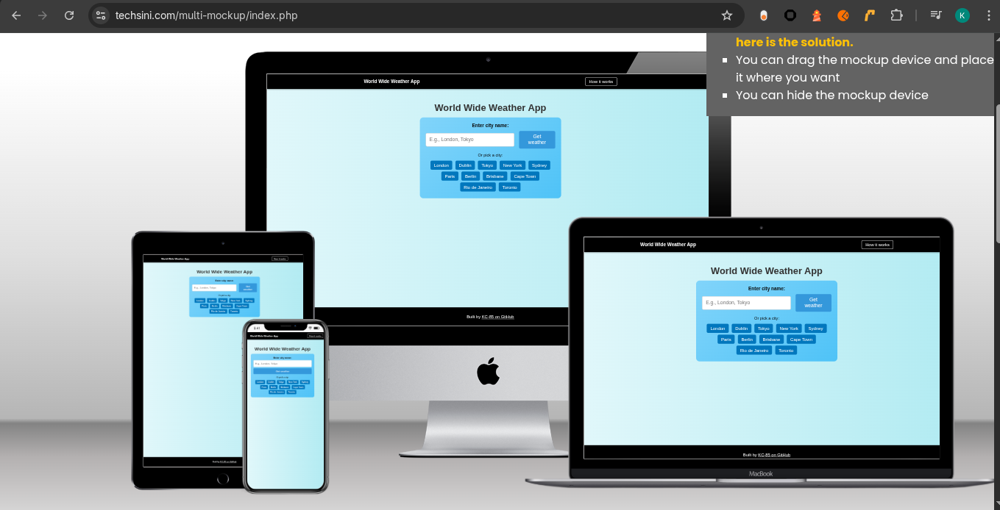

source: [World-Wide-Weather-App amiresponsive](https://ui.dev/amiresponsive?url=https://kc-85.github.io/World-Wide-Weather-App)

> [!IMPORTANT]  
> The examples in these templates are strongly influenced by the Code Institute walkthrough project called "Love Maths".

## UX

### The 5 Planes of UX

#### 1. Strategy

**Purpose**
- Provide users with a quick, lightweight way to check weather information for major cities around the world.
- Offer a clean and focused interface that avoids clutter and prioritises readability.
- Demonstrate a realistic weather app workflow using a local dataset instead of a live API.

**Primary User Needs**
- Enter a city name and instantly see relevant weather information.
- Choose from common cities via quick-access buttons for convenience.
- Understand errors clearly if the city is not found in the dataset.
- Use the app comfortably on mobile, tablet, and desktop devices.

**Business Goals**
- Showcase a well-structured, accessible, and responsive front-end project.
- Demonstrate competence with HTML, CSS, JavaScript, jQuery, JSON data, and basic animation.
- Provide a solid portfolio piece that clearly meets the PP2 learning outcomes.

#### 2. Scope

**[Features](#features)** (see below)

**Content Requirements**
- Introductory “How it works” modal to explain the app’s purpose and usage.
- Search input for entering any city name.
- Quick-select city buttons for popular global cities.
- Weather information card displaying:
  - City name
  - Weather icon (emoji-based)
  - Temperature
  - Weather description
  - Wind speed
  - Last updated date/time
- Error messaging area for invalid or unavailable city searches.
- Sticky navbar and footer for a consistent frame.
- 404 page for non-existing routes.
- Subtle animations via GSAP to improve perceived responsiveness and feedback.

- Clear labels and instructions explaining how to search and what to expect.
- Informative error messages when a city cannot be found in the local dataset.
- Visible, well-structured weather information with clear hierarchy.
- Brief but useful text in the help modal to support first-time users.

#### 3. Structure

**Information Architecture**
- **Navigation Menu**:
  - Simple navbar with accessible links.
- **Hierarchy**:
  - Clear and prominent placement of the input fields and operator buttons.
  - Visible results area and error messages.

**User Flow**
1. User lands on the home page → reads brief instructions.
2. Inputs two numbers → selects an operator.
3. Sees instant results or an error message if input is invalid.
4. Views correct/incorrect equation feedback.
5. Starts fresh with the next calculation.

#### 4. Skeleton

**[Wireframes](#wireframes)** (see below)

#### 5. Surface

**Visual Design Elements**
- **[Colours](#colour-scheme)** (see below)
- **[Typography](#typography)** (see below)

### Colour Scheme

⚠️INSTRUCTIONS ⚠️

Explain your colors and color scheme. Consider adding a link and screenshot for your color scheme using [coolors](https://coolors.co/generate).

When you add a color to the palette, the URL is dynamically updated, making it easier for you to return back to your color palette later if needed. See example below:

⚠️ --- END --- ⚠️

I used [coolors.co](https://coolors.co/e0f7fa-b2ebf2-333333-000000-ffffff) to generate my color palette.

- `#E0F7FA` background.
- `#B2EBF2` primary highlights.
- `#333333` error text.
- `#000000` navbar + footer.
- `#FFFFFF` text.

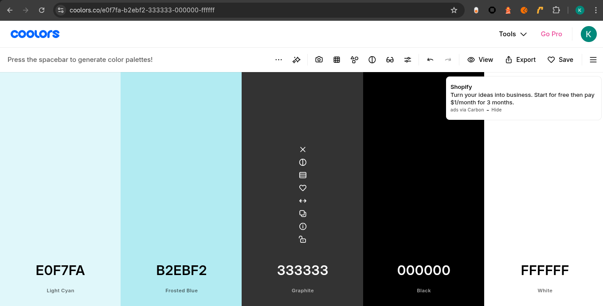

### Typography

⚠️ INSTRUCTIONS ⚠️

Explain any fonts and icon libraries used, like **Google Fonts**, **Font Awesome**, etc. Consider adding a link to each font used, the Font Awesome site (if used), or similar icon library.

⚠️ --- END --- ⚠️

- [Montserrat](https://fonts.google.com/specimen/Montserrat) was used for the primary headers and titles.
- [Lato](https://fonts.google.com/specimen/Lato) was used for all other secondary text.
- [Font Awesome](https://fontawesome.com) icons were used throughout the site, such as the social media icons in the footer.

## Wireframes

⚠️ INSTRUCTIONS ⚠️

If you've created wireframes or mock-ups, use this section to display screenshots of your wireframes. The example table below uses sample pages from the walkthrough project to give you some inspiration for your own project, so please adjust accordingly.

⚠️ --- END --- ⚠️

To follow best practice, wireframes were developed for mobile, tablet, and desktop sizes.
I've used [Balsamiq](https://balsamiq.com/wireframes) to design my site wireframes.

| Page | Mobile | Tablet | Desktop |
| --- | --- | --- | --- |
| Home | 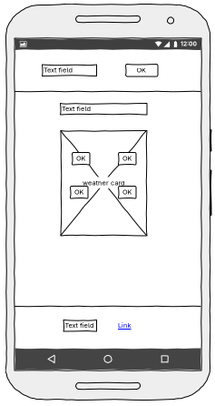 | 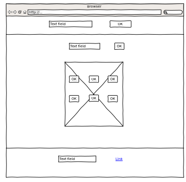 | 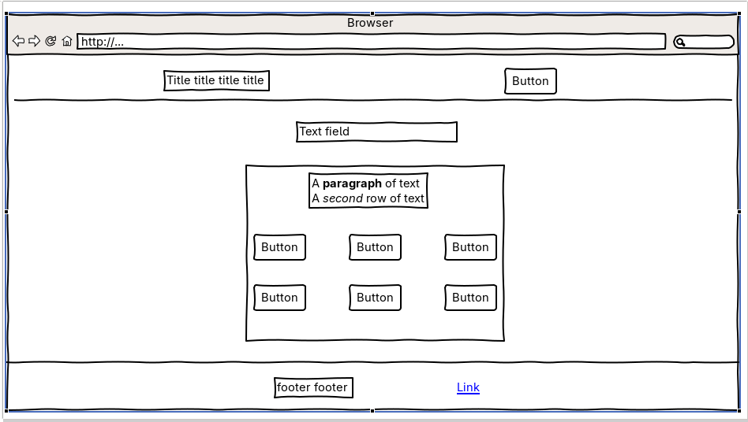 |
| 404 |  |  |  |

## User Stories

| Target | Expectation | Outcome |
| --- | --- | --- |
| As a user | I want to quickly see the current weather for a city | so that I can decide what to wear or plan my activities. |
| As a user | I want to use clearly labelled input fields and buttons | so that I can understand how to search without confusion. |
| As a user | I want to choose from a list of common cities | so that I can get weather data with a single click. |
| As a user | I want to see an error message if the city is not available | so that I know I need to try a different city. |
| As a user | I want the app to work on my mobile phone | so that I can check the weather when I’m on the go. |
| As a user | I want the text and buttons to be readable and accessible | so that I can comfortably use the app even with visual impairments. |
| As a user | I want to see some visual feedback when the weather is updated | so that I notice when the data changes. |
| As a user | I want a “How it works” explanation | so that I can quickly understand the purpose and features of the app. |
| As a user | I want to see a helpful 404 page if I reach a broken link | so that I can easily navigate back to the homepage. |
## Features

⚠️ INSTRUCTIONS ⚠️

In this section, you should go over the different parts of your project, and describe each feature. You should explain what value each of the features provides for the user, focusing on your target audience, what they want to achieve, and how your project can help them achieve these things.

**IMPORTANT**: Remember to always include a screenshot of each individual feature!

⚠️ --- END --- ⚠️

### Existing Features

| Feature | Notes | Screenshot |
| --- | --- | --- |
| **Navbar & Brand** | A fixed navbar across pages shows the app name (“World Wide Weather”) and keeps the top of the UI consistent. The dark background and white text provide strong contrast and clear separation from the main content. | 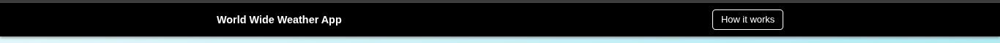 |
| **How it Works Modal** | A dedicated button in the navbar opens an accessible modal dialog explaining how to use the app and that the data is loaded from a local dataset. This supports first-time users and improves overall UX. | 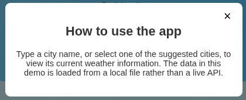 |
| **City Search Input** | Users can type any city name into an input field and click **Get weather** (or press Enter) to request data. Empty submissions are validated with a clear error message. | 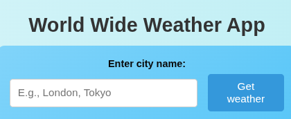 |
| **Quick-Select City Buttons** | A row of quick-select buttons (e.g. London, Dublin, New York, Tokyo, Sydney, etc.) allows users to instantly load weather data for popular major cities with a single click. Each button includes a hover animation for extra interactivity. | 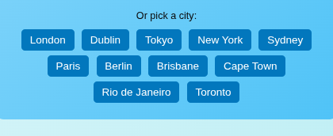 |
| **Weather Information Card** | Once a valid city is found in the local JSON data, a weather card displays the city name, weather icon (emoji), temperature in °C, description, wind speed, and the current date/time formatted via Moment.js. GSAP animations are used to fade/slide this content into view. | 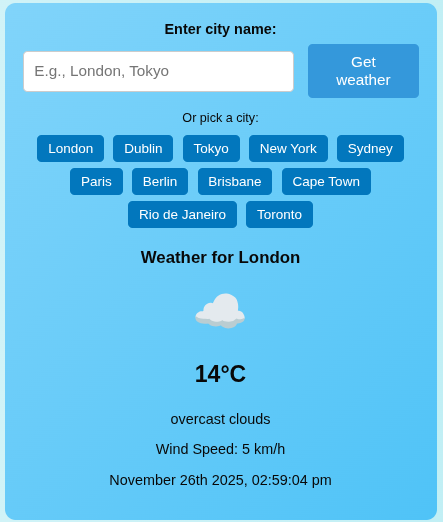 |
| **Error Handling Area** | When the user enters a city that is not available in the demo dataset, a clearly styled error area appears, informing the user that the city is not available and prompting them to try another major city. | 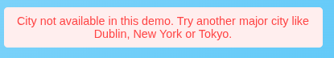 |
| **404 Page** | A custom 404 page matches the app’s styling and provides a friendly message and a **Return to Home** link. This replaces the default GitHub Pages 404 and keeps users within the app’s UX. | 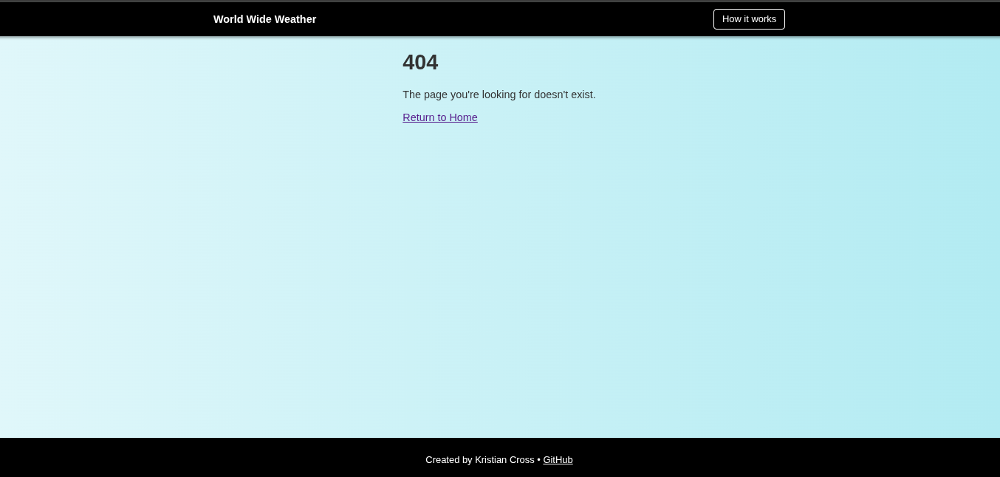 |
| **Responsiveness** | The layout is built mobile-first and scales up to tablet and desktop. The main content is centered with appropriate spacing, and the footer remains stuck to the bottom of the viewport on short pages. | 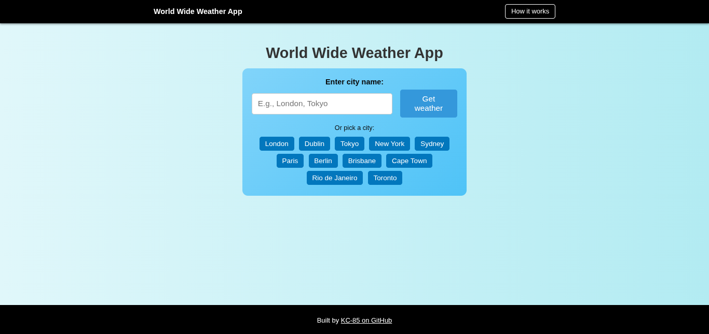 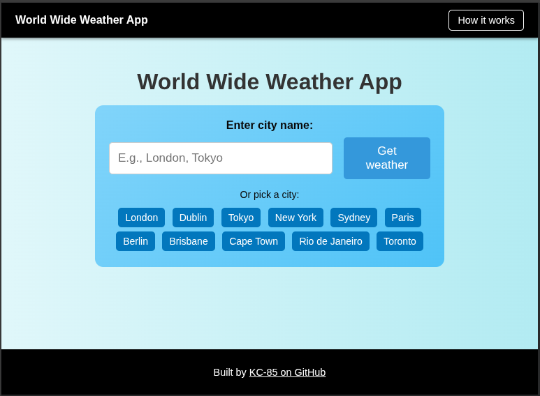 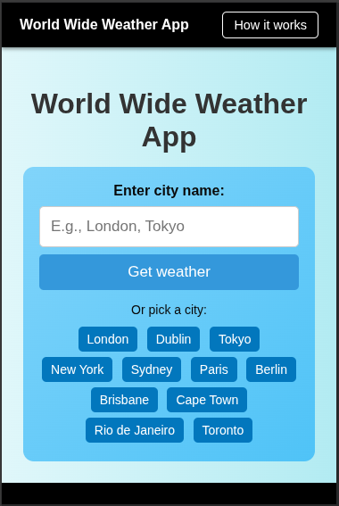 |

### Future Features

**Live Weather API Integration**  
- Reintroduce a secure backend or server-side proxy to connect to a real weather API such as OpenWeatherMap. This would provide genuine real-time data while keeping API keys secure.

**Multi-day Forecast**  
- Extend the weather card to include a 3–5 day forecast so users can see upcoming conditions and plan further ahead.

**Favourite Cities**  
- Allow users to “star” favourite cities and save them in localStorage so they appear as quick-access buttons on return visits.

**Geolocation Support**  
- Offer an option to detect the user’s approximate location (with permission) and automatically show the weather for their nearest major city.

**Units Toggle (°C / °F)**  
- Provide a toggle that switches between Celsius and Fahrenheit to support both international and US-based users.

**Theme Options**  
- Implement light/dark or seasonal themes (e.g. winter, summer) to enhance personalisation and accessibility in different lighting conditions.

## Tools & Technologies

| Tool / Tech | Use |
| --- | --- |
|  | Generate README and TESTING templates. |
|  | Version control. (`git add`, `git commit`, `git push`) |
|  | Secure online code storage. |
| [-grey?logo=gitpod&logoColor=FFAE33)](https://ona.com) | Cloud-based IDE for development. |
|  | Local IDE for development. |
|  | Main site content and layout. |
|  | Design and layout. |
|  | User interaction on the site. |
|  | Smooth animations for UI elements (weather card, buttons, etc.). 
|  | Hosting the deployed front-end site. |
|  | Front-end CSS framework for modern responsiveness and pre-built components. |
|  | Help debug, troubleshoot, and explain things. |
|  | Tutorials/Reference Guide |
|  | Troubleshooting and Debugging |

⚠️ NOTE ⚠️

Want to add more?

- Tutorial: https://shields.io/badges/static-badge
- Icons/Logos: https://simpleicons.org
  - FYI: not all logos are available to use

🛑 --- END --- 🛑

## Agile Development Process

### GitHub Projects

⚠️ TIP ⚠️

Consider adding screenshots of your Projects Board(s), Issues (open and closed), and Milestone tasks.

⚠️ --- END ---⚠️

[GitHub Projects](https://www.github.com/KC-85/World-Wide-Weather-App/projects) served as an Agile tool for this project. Through it, EPICs, User Stories, issues/bugs, and Milestone tasks were planned, then subsequently tracked on a regular basis using the Kanban project board.

### GitHub Issues

[GitHub Issues](https://www.github.com/KC-85/World-Wide-Weather-App/issues) served as an another Agile tool. There, I managed my User Stories and Milestone tasks, and tracked any issues/bugs.

| Link | Screenshot |
| --- | --- |
|  |  |
|  |  |

### MoSCoW Prioritization

I've decomposed my Epics into User Stories for prioritizing and implementing them. Using this approach, I was able to apply "MoSCoW" prioritization and labels to my User Stories within the Issues tab.

- **Must Have**: guaranteed to be delivered - required to Pass the project (*max ~60% of stories*)
- **Should Have**: adds significant value, but not vital (*~20% of stories*)
- **Could Have**: has small impact if left out (*the rest ~20% of stories*)
- **Won't Have**: not a priority for this iteration - future features

## Testing

> [!NOTE]  
> For all testing, please refer to the [TESTING.md](TESTING.md) file.

## Deployment

### GitHub Pages

The site was deployed to GitHub Pages. The steps to deploy are as follows:

- In the [GitHub repository](https://www.github.com/KC-85/World-Wide-Weather-App), navigate to the "Settings" tab.
- In Settings, click on the "Pages" link from the menu on the left.
- From the "Build and deployment" section, click the drop-down called "Branch", and select the **main** branch, then click "Save".
- The page will be automatically refreshed with a detailed message display to indicate the successful deployment.
- Allow up to 5 minutes for the site to fully deploy.

The live link can be found on [GitHub Pages](https://kc-85.github.io/World-Wide-Weather-App).

### Local Development

This project can be cloned or forked in order to make a local copy on your own system.

#### Cloning

You can clone the repository by following these steps:

1. Go to the [GitHub repository](https://www.github.com/KC-85/World-Wide-Weather-App).
2. Locate and click on the green "Code" button at the very top, above the commits and files.
3. Select whether you prefer to clone using "HTTPS", "SSH", or "GitHub CLI", and click the "copy" button to copy the URL to your clipboard.
4. Open "Git Bash" or "Terminal".
5. Change the current working directory to the location where you want the cloned directory.
6. In your IDE Terminal, type the following command to clone the repository:
	- `git clone https://www.github.com/KC-85/World-Wide-Weather-App.git`
7. Press "Enter" to create your local clone.

Alternatively, if using Ona (formerly Gitpod), you can click below to create your own workspace using this repository.

**Please Note**: in order to directly open the project in Ona (Gitpod), you should have the browser extension installed. A tutorial on how to do that can be found [here](https://www.gitpod.io/docs/configure/user-settings/browser-extension).

#### Forking

By forking the GitHub Repository, you make a copy of the original repository on our GitHub account to view and/or make changes without affecting the original owner's repository. You can fork this repository by using the following steps:

1. Log in to GitHub and locate the [GitHub Repository](https://www.github.com/KC-85/World-Wide-Weather-App).
2. At the top of the Repository, just below the "Settings" button on the menu, locate and click the "Fork" Button.
3. Once clicked, you should now have a copy of the original repository in your own GitHub account!

### Local VS Deployment

There are no remaining major differences between the local version when compared to the deployed version online.

## Credits

⚠️ INSTRUCTIONS ⚠️

In the following sections, you need to reference where you got your content, media, and any extra help. It is common practice to use code from other repositories and tutorials (which is totally acceptable), however, it is important to be very specific about these sources to avoid potential plagiarism.

⚠️ --- END ---⚠️

### Content

⚠️ INSTRUCTIONS ⚠️

Use this space to provide attribution links for any borrowed code snippets, elements, and resources. Ideally, you should provide an actual link to every resource used, not just a generic link to the main site. If you've used multiple components from the same source (such as Bootstrap), then you only need to list it once, but if it's multiple Codepen samples, then you should list each example individually. If you've used AI for some assistance (such as ChatGPT or Perplexity), be sure to mention that as well. A few examples have been provided below to give you some ideas.

Eventually you'll want to learn how to use Git branches. Here's a helpful tutorial called [Learn Git Branching](https://learngitbranching.js.org) to bookmark for later.

⚠️ --- END ---⚠️

| Source | Notes |
| --- | --- |
| [Markdown Builder](https://markdown.2bn.dev) | Help generating Markdown files |
| [Chris Beams](https://chris.beams.io/posts/git-commit) | "How to Write a Git Commit Message" |
| [Love Maths](https://codeinstitute.net) | Code Institute walkthrough project inspiration |
| [WebDevSimplified](https://www.youtube.com/watch?v=riDzcEQbX6k) | Inspiration for a quiz app |
| [WebDevSimplified](https://www.youtube.com/watch?v=1yS-JV4fWqY) | Inspiration for Rock Paper Scissors |
| [JavaScript30](https://javascript30.com) | Additional JS help |
| [ChatGPT](https://chatgpt.com) | Help with code logic and explanations |

### Media

⚠️ INSTRUCTIONS ⚠️

Use this space to provide attribution links to any media files borrowed from elsewhere (images, videos, audio, etc.). If you're the owner (or a close acquaintance) of some/all media files, then make sure to specify this information. Let the assessors know that you have explicit rights to use the media files within your project. Ideally, you should provide an actual link to every media file used, not just a generic link to the main site, unless it's AI-generated artwork.

Looking for some media files? Here are some popular sites to use. The list of examples below is by no means exhaustive.

- Images
    - [Pexels](https://www.pexels.com)
    - [Unsplash](https://unsplash.com)
    - [Pixabay](https://pixabay.com)
    - [Lorem Picsum](https://picsum.photos) (placeholder images)
    - [Wallhere](https://wallhere.com) (wallpaper / backgrounds)
    - [This Person Does Not Exist](https://thispersondoesnotexist.com) (reload to get a new person)
- Image Compression
    - [TinyPNG](https://tinypng.com) (for images <5MB)
    - [CompressPNG](https://compresspng.com) (for images >5MB)

A few examples have been provided below to give you some ideas on how to do your own Media credits.

⚠️ --- END ---⚠️

| Source | Notes |
| --- | --- |
| [favicon.io](https://favicon.io) | Generating the favicon |
| [Font Awesome](https://fontawesome.com) | Icons used throughout the site |
| [Pexels](https://images.pexels.com/photos/416160/pexels-photo-416160.jpeg) | Hero image |
| [Wallhere](https://c.wallhere.com/images/9c/c8/da4b4009f070c8e1dfee43d25f99-2318808.jpg!d) | Background wallpaper |
| [Pixabay](https://cdn.pixabay.com/photo/2017/09/04/16/58/passport-2714675_1280.jpg) | Background wallpaper |
| [Mixkit](https://mixkit.co/free-sound-effects/game) | Royalty-free sound effects for the game |
| [DALL-E 3](https://openai.com/index/dall-e-3) | AI generated artwork |
| [TinyPNG](https://tinypng.com) | Compressing images < 5MB |
| [CompressPNG](https://compresspng.com) | Compressing images > 5MB |
| [CloudConvert](https://cloudconvert.com/webp-converter) | Converting images to `.webp` |

### Acknowledgements

⚠️ INSTRUCTIONS ⚠️

Use this space to provide attribution and acknowledgement to any supports that helped, encouraged, or supported you throughout the development stages of this project. It's always lovely to appreciate those that help us grow and improve our developer skills. A few examples have been provided below to give you some ideas.

⚠️ --- END ---⚠️

- I would like to thank my Code Institute mentor, [Tim Nelson](https://www.github.com/TravelTimN) for the support throughout the development of this project.
- I would like to thank the [Code Institute](https://codeinstitute.net) Tutor Team for their assistance with troubleshooting and debugging some project issues.
- I would like to thank the [Code Institute Slack community](https://code-institute-room.slack.com) and [Code Institute Discord community](https://discord-portal.codeinstitute.net) for the moral support; it kept me going during periods of self doubt and impostor syndrome.
- I would like to thank my partner, for believing in me, and allowing me to make this transition into software development.
- I would like to thank my employer, for supporting me in my career development change towards becoming a software developer.

