# Testing

> [!NOTE]  
> Return back to the [README.md](README.md) file.

## Code Validation

### HTML

I have used the recommended [HTML W3C Validator](https://validator.w3.org) to validate all of my HTML files.

| Directory | File | URL | Screenshot | Notes |
| --- | --- | --- | --- | --- |
|  | [index.html](https://github.com/KC-85/World-Wide-Weather-App/blob/main/index.html) | [HTML Validator](https://validator.w3.org/nu/?doc=https://kc-85.github.io/World-Wide-Weather-App/index.html) | 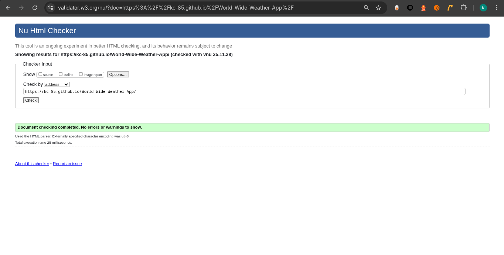 |  |

### CSS

I have used the recommended [CSS Jigsaw Validator](https://jigsaw.w3.org/css-validator) to validate all of my CSS files.

| Directory | File | URL | Screenshot | Notes |
| --- | --- | --- | --- | --- |
| assets | [style.css](https://github.com/KC-85/World-Wide-Weather-App/blob/main/assets/css/style.css) | [CSS Validator](https://jigsaw.w3.org/css-validator/validator?uri=https://kc-85.github.io/World-Wide-Weather-App) | 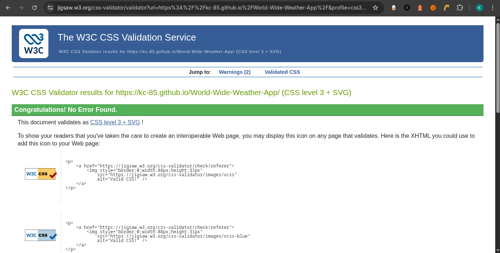 |  |

### JavaScript

I have used the recommended [JShint Validator](https://jshint.com) to validate all of my JS files.

| Directory | File | URL | Screenshot | Notes |
| --- | --- | --- | --- | --- |
| assets | [script.js](https://github.com/KC-85/World-Wide-Weather-App/blob/main/assets/js/script.js) |  | 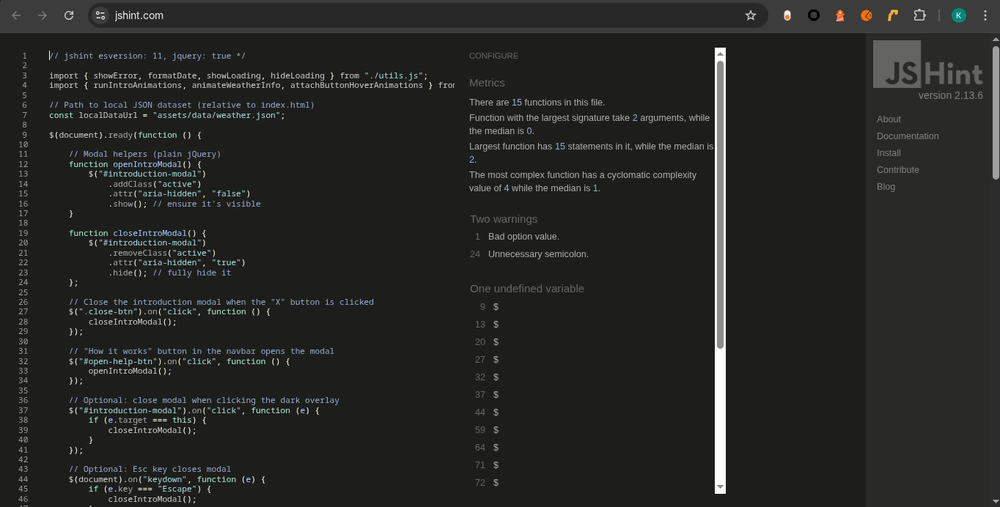 |  |
| assets | [utils.js](https://github.com/KC-85/World-Wide-Weather-App/blob/main/assets/js/utils.js) |  | 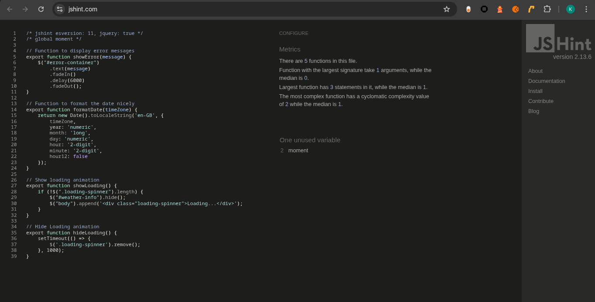 |  |
| assets | [animations.js](https://github.com/KC-85/World-Wide-Weather-App/blob/main/assets/js/animations.js) |  | 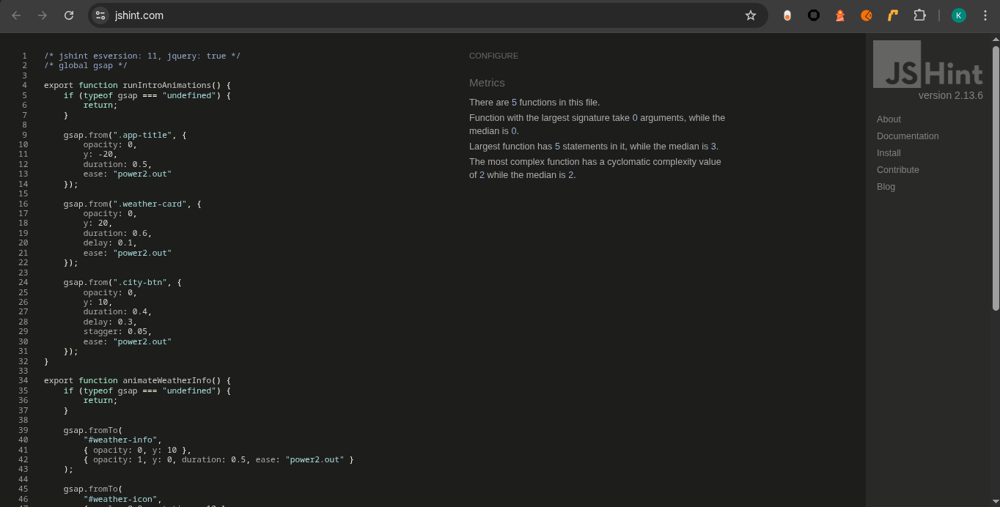 | |

## Responsiveness

I've tested my deployed project to check for responsiveness issues.

| Page | Mobile | Tablet | Desktop | Notes |
| --- | --- | --- | --- | --- |
| Home | 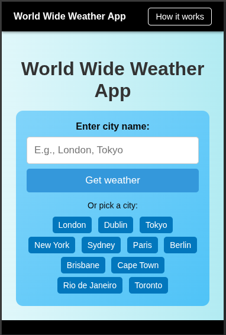 | 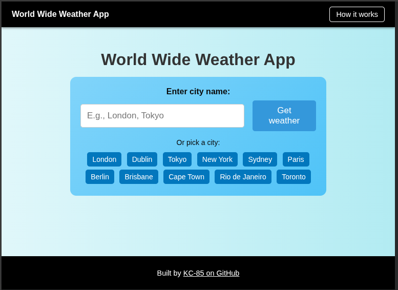 | 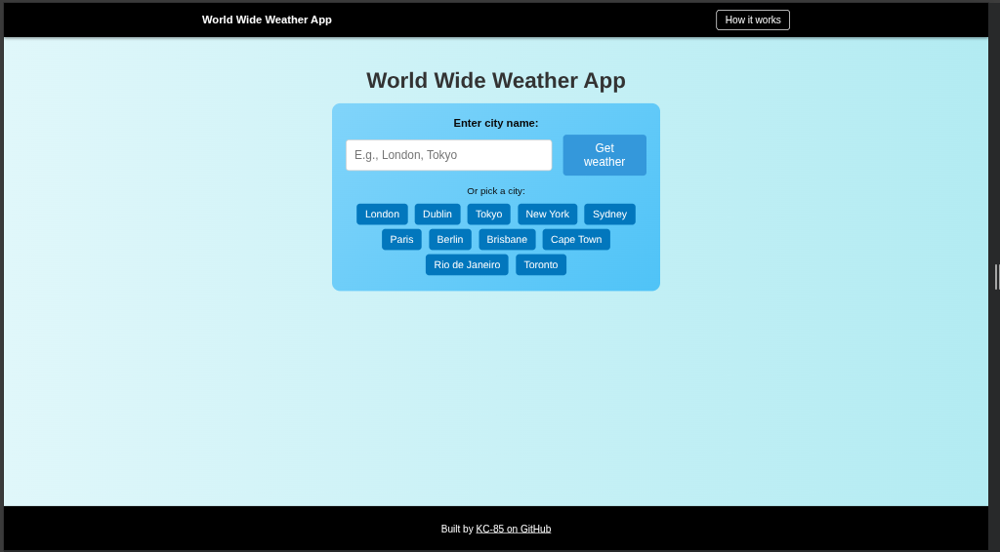 | Works as expected |
| 404 | 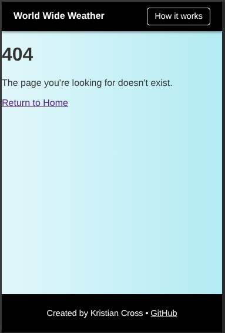 | 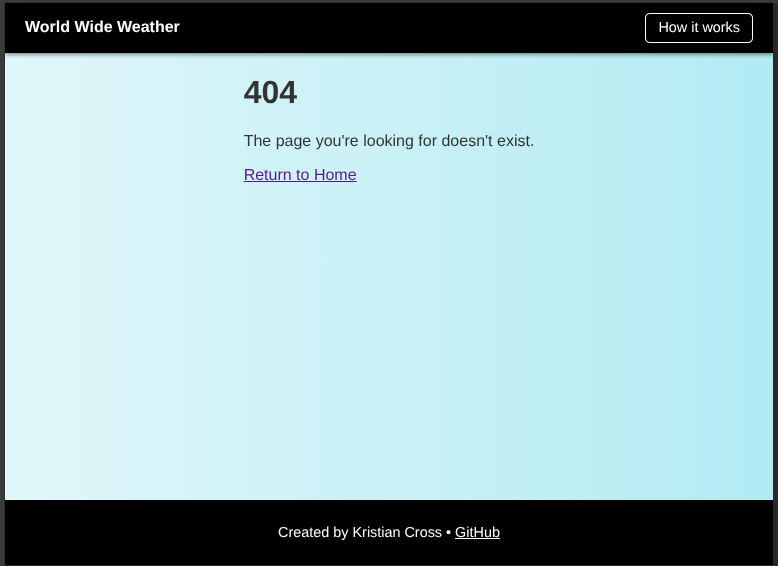 | 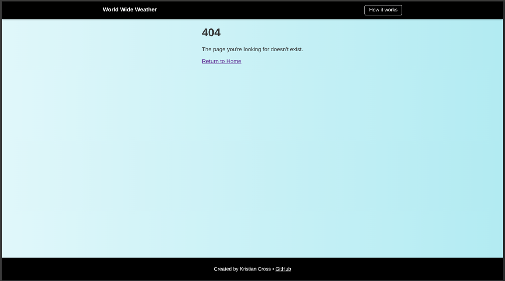 | Works as expected |

## Browser Compatibility

I've tested my deployed project on multiple browsers to check for compatibility issues.

| Page | Chrome | Firefox | Brave | Notes |
| --- | --- | --- | --- | --- |
| Home | 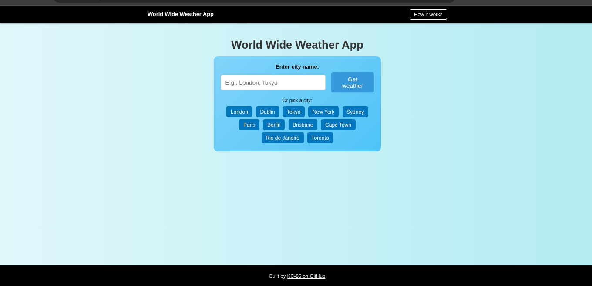 | 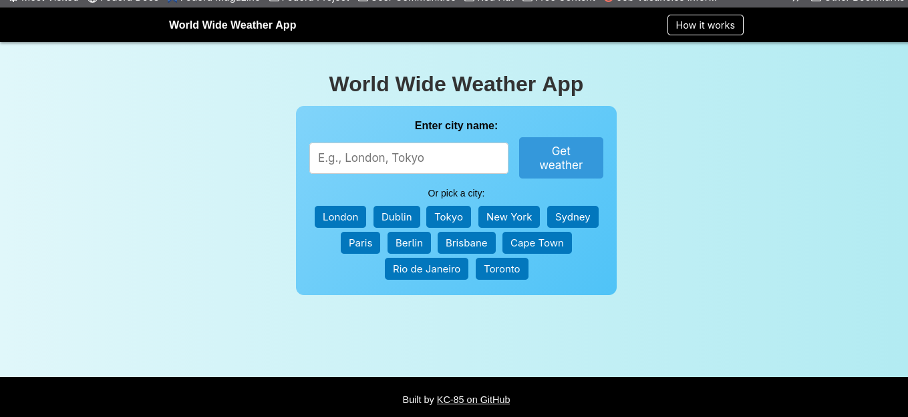 | 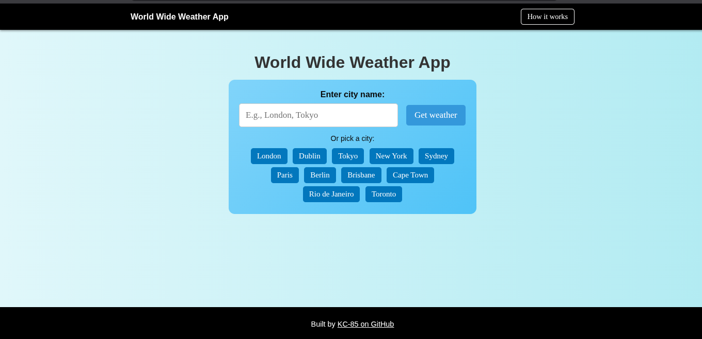 | Works as expected |
| 404 | 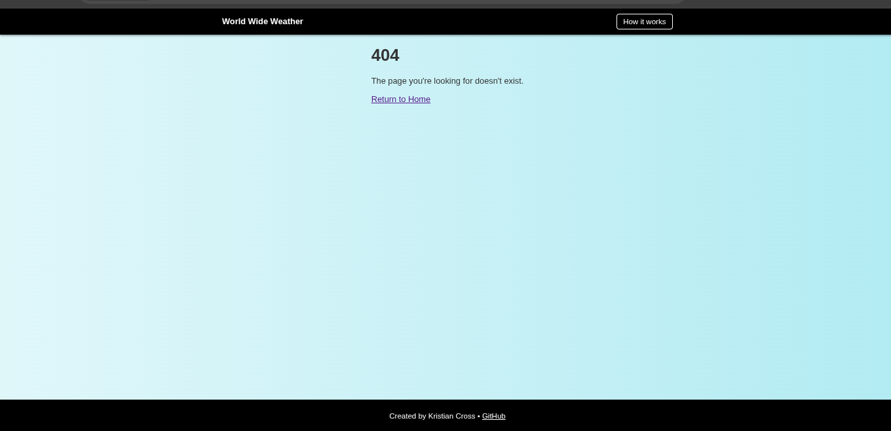 | 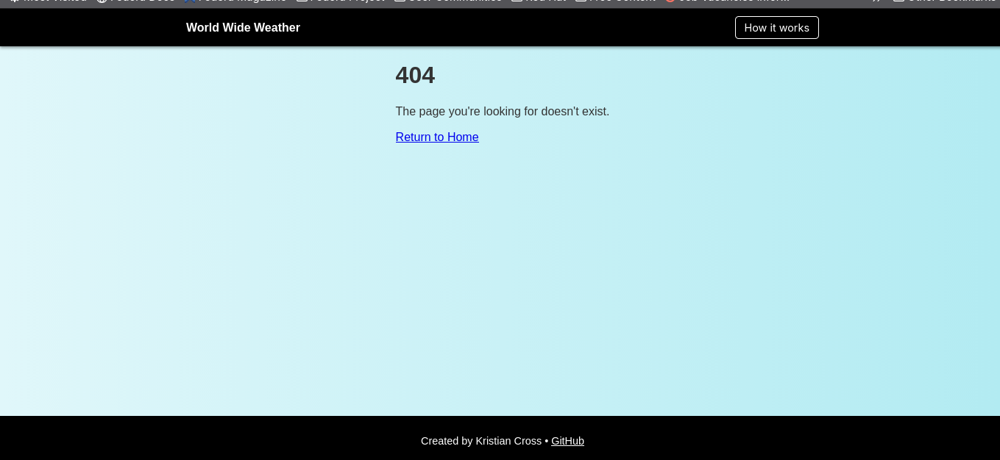 | 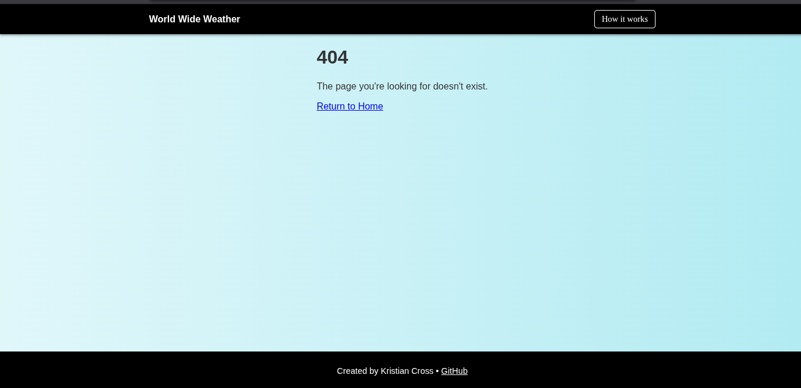 | Works as expected |

## Lighthouse Audit

I've tested my deployed project using the Lighthouse Audit tool to check for any major issues. Some warnings are outside of my control, and mobile results tend to be lower than desktop.

| Page | Mobile | Desktop |
| --- | --- | --- |
| Home | 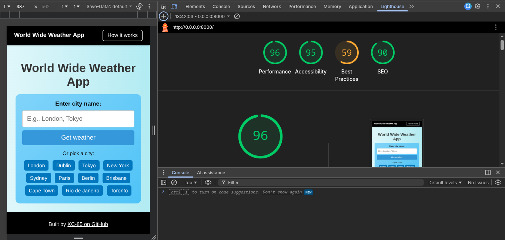 | 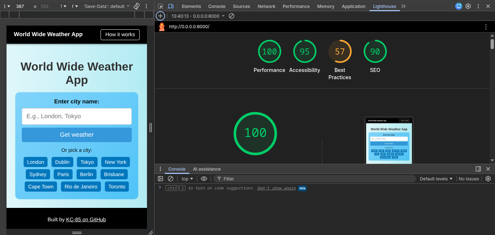 |
| 404 | 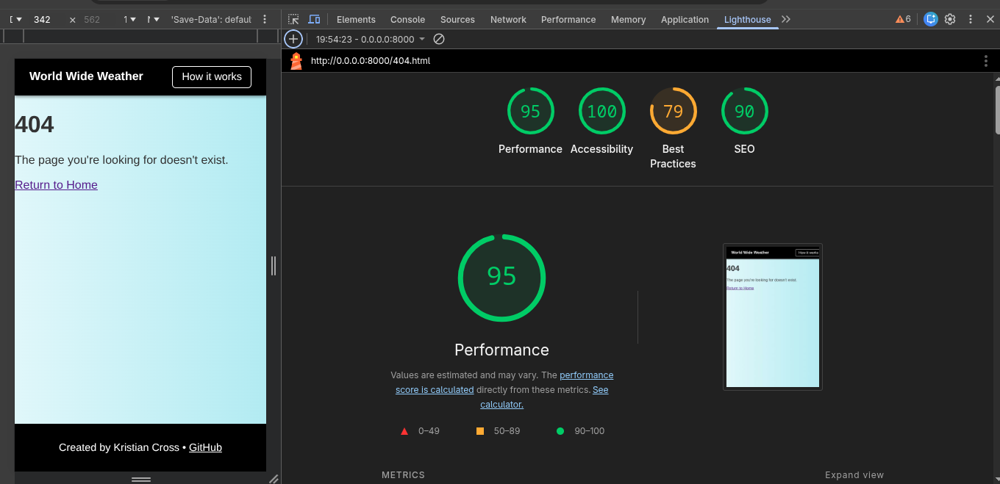 | 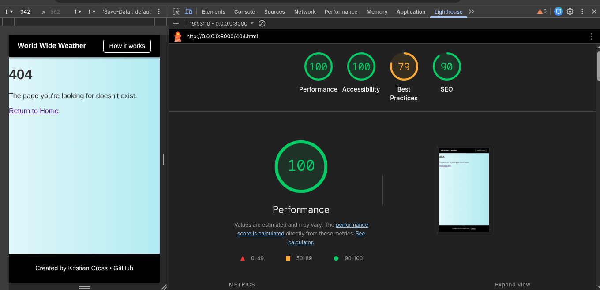 |

## User Story Testing

| Target | Expectation | Outcome | Screenshot |
| --- | --- | --- | --- |
| As a user	| I want to quickly see the current weather for a city	so that I can decide what to wear or plan my activities. | The search input and quick city buttons load weather data into the weather card, showing temperature, conditions, and wind speed. |  |
| As a user	| I want to use clearly labelled input fields and buttons	so that I can understand how to search without confusion. | The input label “Enter City Name” and the Get Weather button are visible and self-explanatory. |  |
| As a user	| I want to choose from a list of common cities	| so that I can get weather data with a single click. | Quick-select buttons for major cities (e.g. London, Dublin, New York, Tokyo, etc.) are positioned below the input for easy access. |  |
| As a user | I want to see an error message if the city is not available | so that I know I need to try a different city. | When entering an unsupported city, the error container displays a clear message and the weather card is not updated with invalid data. |  |
| As a user	| I want the app to work on my mobile phone | so that I can check the weather when I’m on the go.	| The layout adapts to smaller screens, with stacked input/button layout and readable text. Tested via DevTools and (if applicable) real device. |  |
| As a user	| I want the text and buttons to be readable and accessible | so that I can comfortably use the app even with visual impairments. | High-contrast navbar/footer, readable font sizes, clear button labels, and accessible error messages support this. |  |
| As a user	| I want a “How it works” explanation | so that I can quickly understand the purpose and features of the app. | The How it works button opens a modal with a short explanation of how to use the site. |  |
| As a user | I want to see a helpful 404 page | if I reach a broken link | so that I can easily navigate back to the homepage.	| The custom 404 page displays an error message and a Return to Home link. |  |

## Bugs

| Bug | Explanation | Screenshot |
| --- | --- | --- |
| Navbar + Footer | The navbar and footer was either side of the screen during development | 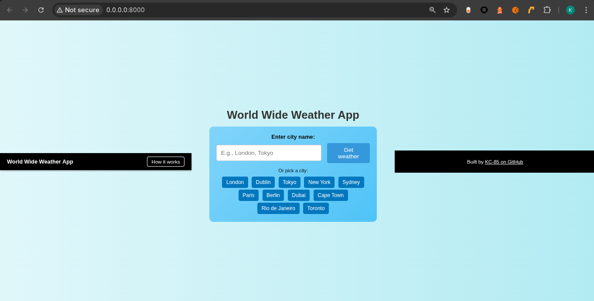 |

### Fixed Bugs

| Fixed Bug | Screenshot | Notes |
| --- | --- | --- |
| Navbar + Footer |  | Works as expected |

### Unfixed Bugs

- All known bugs have been fixed.

### Known Issues

> [!IMPORTANT]  
> There are no remaining bugs that I am aware of, though, even after thorough testing, I cannot rule out the possibility.

